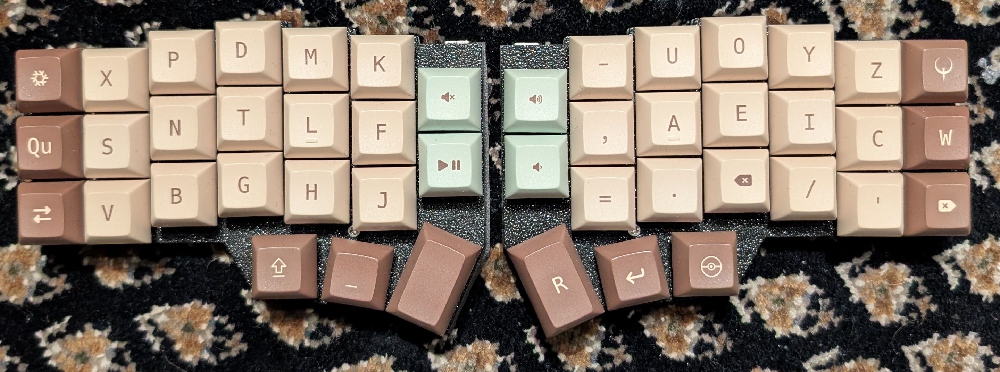

# The Corne v4 keyboard with SNTLF layout

I use the [Corne v4.1 keyboard from foostan]() with my own custom layout.

## Keyboard layout
My keyboard layout is heavily inspired by [Hands Down Promethium](https://www.reddit.com/r/KeyboardLayouts/comments/1g66ivi/hands_down_promethium_snth_meets_hd_silverengram/).