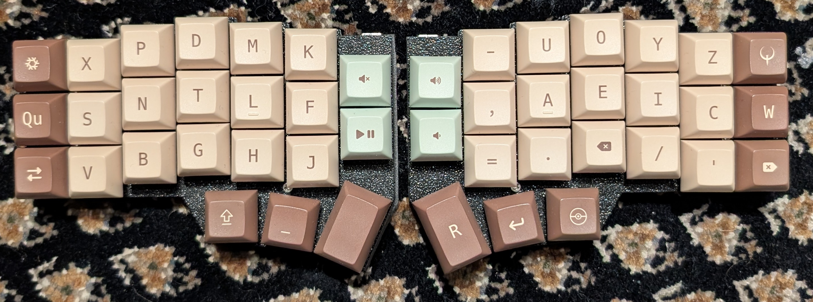

# Corne keyboard with Sunflower layout

I use the [Corne v4.1 keyboard from foostan]() with my own custom layout. It uses the TTC silent bluish white switches with custom keycaps from [Yuzu](https://yuzukeycaps.com/).

## Keyboard layout
I've made my own keyboard layout: [Sunflower](sunflower_layout.md).